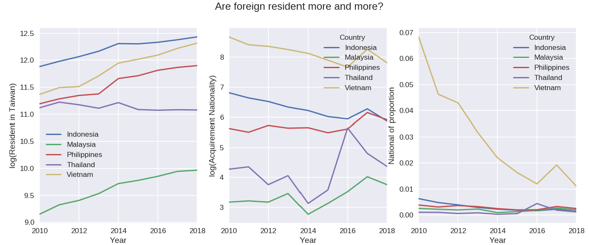

# Project
The trend of foreign resident and becoming national

## Question
Are foreign resident more and more? Can it affect our number of acquirement nationality being increasing?

## Data source
Region: Taiwan, Domain category: Numbers of 'acquirement of the R.O.C. Nationality by Causes and Home Country' and 'Foreign Residents', by year(2010-2019)
  1. [Foreigner resident 外僑居留人數按國籍、職業分](https://www.moi.gov.tw/files/site_stuff/321/2/year/year.html)
  2. [Acquirement of the R.O.C. Nationality by Causes and Home Country 國籍之歸化取得人數](https://www.moi.gov.tw/files/site_stuff/321/2/year/year.html)
  
# Plot

 
# Summary
The first plot, we can know the number of foreign residents in Taiwan(I call it resident) is more and more, be careful, they are log(resident), so the growth is very high( for example, Malaysia's growth of average is 10%) And the second plot, we can find a problem. Why the number of acquirement nationality(I call it nationality) is not increasing stable?. In the last plot, we can find Vietnam's trend is decreasing fast, other countries have the same trend. (rate less than Vietnam) Maybe the reason is more people work in Taiwan, but just work, they don't want to apply to get nationality. or maybe the government adjust the application threshold, or maybe have more reasons.

But, we know the number of acquirements of nationality not only related to the number of foreign residents.
